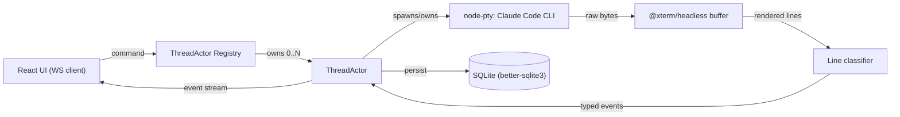
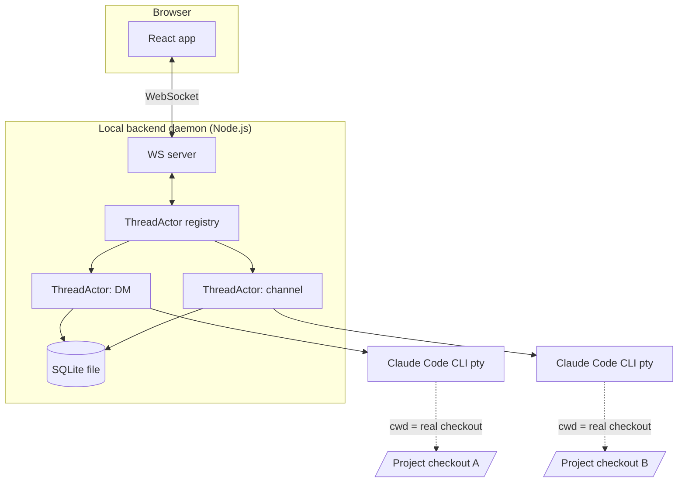

# Architecture Spine — BMad Chat UI

## Design Paradigm

**Actor model.** Every open DM or channel thread is a `ThreadActor`: a single in-process object that owns one real pty-wrapped Claude Code CLI process, that process's headless-rendered terminal buffer, and the thread's message history. A `ThreadActor` has a mailbox of commands in (`send-message`, `stop-turn`, `open-in-terminal`) and an outbox of typed events out (to WS subscribers and the SQLite writer). The actor's lifecycle *is* the pty's lifecycle — there is no separate "is this thread alive" state to keep in sync with the process table.



- `src/actors/ThreadActor.ts` — the actor: mailbox, pty ownership, event emission.
- `src/actors/registry.ts` — maps `threadId -> ThreadActor`, creates on first open, idle-reaps.
- `src/pty/` — node-pty spawn, cwd/symlink activation (see AD-2).
- `src/parsing/` — `@xterm/headless` buffer + line classifier (see AD-3).
- `src/persistence/` — better-sqlite3 schema + repositories.
- `src/ws/` — WS server, envelope encode/decode (see Consistency Conventions).
- `web/` — React/Vite frontend.

## Invariants & Rules

### AD-1 — One long-lived pty per open thread

- **Binds:** CAP-1, CAP-3, CAP-4
- **Prevents:** per-turn cold-start latency, and "is this persona working" state tracked separately from the actual process.
- **Rule:** A `ThreadActor` spawns its Claude Code CLI pty on first open and keeps it alive across turns while idle. It self-enforces its own idle timer and crash handling: on unexpected pty exit *or* idle-timeout, it kills its own pty, persists `status=stopped`, emits a `system` event explaining why, and only then tells the registry to deregister it. The registry never kills a pty or reaches into an actor's state directly — deregistration is always actor-initiated, one direction, so two independently built halves (e.g. a reaper sweep and a crash handler) can't race into a double-kill or leave an orphaned pty. The next message respawns the actor and relies on Claude Code's own session resume to restore conversational context; no code path resumes a persona's history by re-invoking the CLI per turn.

### AD-2 — Project activation is cwd + symlink overlay, owned by one module `[ADOPTED]`

- **Binds:** CAP-2
- **Prevents:** the historical bug — sessions launching with cwd inside a symlink directory, breaking `@`-mention/relative-path resolution and misrouting memory/artifacts.
- **Rule:** A `Thread` row is created (if absent) before an activation attempt. Before any `ThreadActor` spawns a pty for a project, `src/pty/activateProject.ts` runs: (1) verify/set cwd to the real project checkout, never a symlink directory; (2) ensure BMad's canonical skills/`_bmad` are overlaid into that checkout via symlinks; (3) ensure those symlink paths are listed in that repo's `.git/info/exclude`, never a committed `.gitignore`. No other module spawns a pty directly, and no other module invents its own retry/fallback for a failed activation — this is the only path a project's cwd is established. If `activateProject()` throws, the owning `ThreadActor` never spawns the pty; it persists `status=stopped` on the (already-created) `Thread` row and emits one `system` event carrying the failure reason.

### AD-3 — Pty bytes become chat events only through the render-then-classify pipeline

- **Binds:** CAP-1, CAP-3, CAP-4
- **Prevents:** two features each pattern-matching raw ANSI bytes independently and disagreeing on what counts as a tool-card boundary vs. a redraw artifact.
- **Rule:** Raw pty output is fed into an `@xterm/headless` buffer per thread; only the buffer's rendered, de-flickered text reaches the line classifier. The classifier is the single place that maps rendered lines to `message` / `tool-card` / `subagent-card` / `status` events (Consistency Conventions has the event vocabulary). No other module re-derives chat semantics by re-parsing pty bytes or by re-invoking the CLI in a different output mode.

### AD-4 — Party-mode channels stay single-process `[ADOPTED]`

- **Binds:** CAP-4
- **Prevents:** multiplying pty processes per channel, or backend-invented multi-agent orchestration that drifts toward the rejected separate-runtime non-goal.
- **Rule:** A channel (party-mode) thread is one `ThreadActor` running one pty that invokes the `bmad-party-mode` skill in its default `session` mode. Per-persona attribution in the UI comes from the classifier recognizing that skill's own turn markers (`{icon} **{name}:**`), never from spawning one pty per persona.

### AD-5 — Chat skin only, always real execution `[ADOPTED]`

- **Binds:** all
- **Prevents:** a shadow/simulated execution path, or any code that could answer a chat message without going through the real pty-wrapped CLI.
- **Rule:** Every user-visible persona action (file edit, skill invocation, command run) must trace to output the classifier read from the real Claude Code pty for that thread. No component may synthesize a persona reply, tool-card, or status change independent of that stream.

### AD-6 — One room per project, no cross-project thread `[ADOPTED]`

- **Binds:** CAP-2, CAP-3
- **Prevents:** a cross-project or cross-company single-thread feature (e.g. a "search all projects" or "global inbox" view) being built as a first-class thread type.
- **Rule:** `Thread.projectId` is non-nullable and every `ThreadActor` is scoped to exactly one project's activated checkout (AD-2). Any cross-project view (e.g. a notification tray) reads across `Thread` rows for display only — it is never itself a `Thread`/`ThreadActor`, and it never opens a live per-thread WS subscription just to show a status badge (that would silently spawn a pty per AD-1, defeating idle-reap). It reads `Thread.status` via the REST bootstrap layer plus the shared `presence` WS channel (Consistency Conventions).

### AD-7 — Add-project directory selection is backend-driven, not an OS/browser native picker

- **Binds:** CAP-2
- **Prevents:** a plain-browser "Add project" flow that can't actually produce a filesystem path usable as a pty `cwd` — there is no Electron here (Structural Seed), and the browser File System Access API's `showDirectoryPicker` returns an opaque handle, not an absolute path.
- **Rule:** The backend exposes a read-only directory-listing endpoint (`GET /api/fs/browse?path=...`); the frontend renders an in-app breadcrumb directory browser against it. Only a path the backend itself resolved and returned is ever written to `Project.path` — no client-supplied path string is trusted verbatim.

## Consistency Conventions

| Concern | Convention |
| --- | --- |
| Bootstrap vs. live transport | Project list, persona catalog, thread list, and paginated message history are fetched via a plain REST layer (`GET /api/projects`, `GET /api/projects/:id/threads`, `GET /api/threads/:id/messages`) *before* opening a thread's WS connection. WS carries only live events/commands for an already-open thread, never initial state. A separate lightweight `presence` WS channel broadcasts `{threadId, status}` deltas for list/tray views — it is not a per-thread subscription and triggers no pty spawn. |
| WS wire envelope | Every frame on a thread's live channel is `{ type, threadId, payload, ts }` JSON. Events: `message.delta`, `message.complete`, `tool-card.open/update/close`, `subagent-card.open/close`, `status` (`idle\|working\|needs-input\|stopped`), `system`. Commands: `send-message`, `stop-turn`, `open-in-terminal`. |
| Naming | Entities: `Project`, `Persona` (global catalog), `Thread` (`kind: dm\|channel`), `ThreadParticipant`, `Message`. Table names snake_case plural; TS types PascalCase singular. |
| Data & formats | `id` = string (nanoid); `createdAt`/`ts` = ISO-8601 UTC. A tool-card or subagent-card is minted as a `Message` row (kind `tool-card`/`subagent-card`) by the `ThreadActor` at `*.open` time — before the WS event broadcasts — and both the persisted row and the WS event carry the same `parentMessageId` referencing that row's id; there is no second, WS-only id space. |
| State & cross-cutting | Only a `ThreadActor` mutates its own thread's rows and pty; the registry only creates-if-absent/looks up actors, never reaches into one's state or kills its pty (AD-1). Errors surface as a `system`-kind message in the thread, never a silent log-only failure (per CAP-2's inline-correction requirement). |

## Stack

| Name | Version |
| --- | --- |
| Node.js | >=20.19 or >=22.12 |
| TypeScript | current LTS-compatible (5.x) |
| node-pty | 1.1.0 |
| @xterm/headless | 6.0.0 |
| better-sqlite3 | 13.0.3 |
| ws | 8.21.3 |
| React | 19.3.0 |
| Vite | 8.3.0 (scaffold with `npm create vite@latest` — re-resolve create-vite's own patch version at scaffold time rather than pinning it here) |

## Structural Seed



Deployment & environments: single machine, single process pair (Vite dev server or static build served by the backend daemon, plus the Node backend) — no separate environments, no external hosting; this is a local dev tool, not a deployed service. The SQLite file and per-project symlink overlays are the only persistent state.

Idle-reap: a `ThreadActor`'s pty is killed after a configurable idle window (default 30 min) with no open WS subscriber and no in-flight turn.

Entity model: `Persona` (`id`, `agentSkillId`, `name`) is a **global catalog**, sourced once from BMad's agent config — never duplicated per project. CAP-3's "persona as persistent per-project contact" is realized entirely by `Thread`: a `dm`-kind `Thread` is unique on `(projectId, personaId)`; that row, not a `Persona` row, is what's scoped per project. `Message` (`id`, `threadId`, `speakerPersonaId` nullable for the user, `kind: text|tool-card|subagent-card|system`, `content`, `parentMessageId` nullable, `createdAt`) carries a persisted `Thread.status` column that a `ThreadActor` writes on every status change (read by the `presence` channel and REST bootstrap, per Consistency Conventions).

```text
bmad-room-chat-ui/            # new package, lives alongside this repo's existing _bmad tooling
  src/
    actors/                  # ThreadActor + registry (AD-1)
    pty/                     # spawn + project activation (AD-2)
    parsing/                 # xterm/headless buffer + line classifier (AD-3)
    persistence/             # better-sqlite3 schema + repositories
    http/                    # REST bootstrap endpoints + fs-browse (AD-7)
    ws/                      # WS server, envelope encode/decode + presence channel
  web/                       # React/Vite frontend (DESIGN.md tokens, EXPERIENCE.md components)
```

## Capability → Architecture Map

| Capability | Lives in | Governed by |
| --- | --- | --- |
| CAP-1 (real execution, no shadow path) | `src/actors`, `src/pty` | AD-1, AD-5 |
| CAP-2 (per-project cwd/context, inline sync messages) | `src/pty/activateProject.ts`, `src/http` | AD-2, AD-7, Consistency Conventions (state row) |
| CAP-3 (persona as persistent per-project contact) | `src/persistence` (`Persona`, `Thread kind=dm`), `src/actors` | AD-1, entity model |
| CAP-4 (party mode as group chat) | `src/actors` (channel `ThreadActor`), `src/parsing` | AD-3, AD-4 |

## Deferred

- **Notification delivery mechanics** (browser `Notification` API permission flow, focus detection) — implementation detail of a settled UX requirement (EXPERIENCE.md), not an architectural fork.
- **Open-in-terminal launch mechanism** (OS-specific terminal app invocation) — platform detail, doesn't affect any other unit's build.
- **Message-formatting depth** (code blocks, diffs, markdown rendering) and **additional keyboard shortcuts** — EXPERIENCE.md explicitly leaves these open for direct iteration.
- **Multi-persona process isolation (agent-team party mode)** — `bmad-party-mode`'s `subagent`/`agent-team` modes spawn real additional Claude Code agents; out of scope for v1's single-pty channel model (AD-4). Revisit only if session-mode attribution proves insufficient in practice.
- **Auth / multi-user** — explicitly out of scope (hobby, single user, single machine per EXPERIENCE.md); no seed laid for it.
- **Monetization / paid tiers** — explicit non-goal per SPEC.md; no billing/entitlement seed laid anywhere in this spine.
